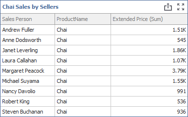

<!-- default badges list -->

<!-- default badges end -->
<!--
A repository template for creating new examples.
-->

# Dashboard for WinForms - Filter the Extract Data Source 

The following example creates a data extract from the Excel data source and shows how to filter the extracted data.

* [ExtractSourceOptions.Filter](https://docs.devexpress.com/Dashboard/DevExpress.DashboardCommon.ExtractSourceOptions.Filter)

     Specifies the `[CategoryName] = 'Beverages'` expression. This expression allows you to include only rows related to _Beverages_ category in the created data extract. 

* [DashboardExtractDataSource.Filter](https://docs.devexpress.com/Dashboard/DevExpress.DashboardCommon.DashboardExtractDataSource.Filter)

    Filters data loaded to a dashboard from the extract data source. The following expressions allows you to display only _Chai_ product: `[ProductName] = 'Chai'`. 

As a result, the Grid dashboard item displays the sales of the _Chai_ product from the _Beverages_ category for each seller:

<!-- default file list -->

## Files to Look At

- [DesignerForm1.cs](/CS/ExtractFiltering/DesignerForm1.cs) (VB: [DesignerForm1.vb](/VB/ExtractFiltering/DesignerForm1.vb))

<!-- default file list end --> 

## Documentation

- [ExtractSourceOptions.Filter](https://docs.devexpress.com/Dashboard/DevExpress.DashboardCommon.ExtractSourceOptions.Filter)
- [DashboardExtractDataSource.Filter](https://docs.devexpress.com/Dashboard/DevExpress.DashboardCommon.DashboardExtractDataSource.Filter)
- [Filtering](https://docs.devexpress.com/Dashboard/17636/winforms-dashboard/winforms-designer/create-dashboards-in-the-winforms-designer/providing-data/extract-data-source/filtering)
- [Extract Data Source](https://docs.devexpress.com/Dashboard/115900/winforms-dashboard/winforms-designer/create-dashboards-in-the-winforms-designer/providing-data/extract-data-source)

## More Examples

- [Dashboard for WinForms - Dashboard with Extract Data Source](https://github.com/DevExpress-Examples/winforms-dashboard-extract-data-source)
- [Dashboard for WinForms - How to customize the Data Source Wizard and invoke it in the DashboardViewer](https://github.com/DevExpress-Examples/Dashboard-Customize-ExtractDataSource-Wizard)

